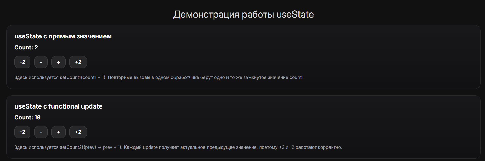
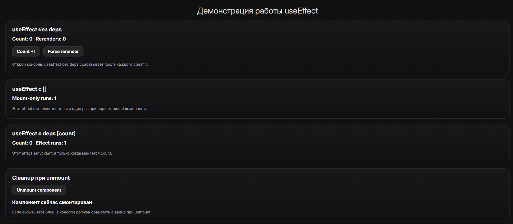

# 🧠 My Little React

> Минимальная реализация React-подобного рендера с поддержкой hooks (`useState`, `useEffect`) и демонстрацией их поведения

---

## 🔗 Демо

👉 **Live demo:**

```
https://my-little-react.vercel.app/
```

---

## 📸 Скриншоты

### useState



---

### useEffect



---

## 🚀 О проекте

Этот проект — попытка **с нуля реализовать упрощённую модель React**, чтобы глубоко понять:

- как работает reconciliation
- как хранятся и сопоставляются hooks
- почему важен порядок вызова hooks
- как работает `useEffect` (mount / update / cleanup)
- как работает `useState`

---

## 🧠 Что я изучил

В процессе реализации я разобрал на практике:

- 🔁 **Reconciliation**
  - как происходит сравнение старого и нового дерева
  - что именно значит “перерендер” на уровне DOM
- 🧩 **Fiber-модель (упрощённо)**
  - как хранится состояние компонента
  - как привязываются hooks к конкретному инстансу
- 🎣 **Hooks под капотом**
  - почему hooks завязаны на порядок вызова
  - как работает индексная модель (`hooks[i]`)
  - откуда берётся правило “не вызывать условно”
- 🔄 **useState**
  - разница между прямым значением и functional update
  - проблема stale closure
- ⚡ **useEffect**
  - когда именно выполняется effect (после commit)
  - разница между `[]`, `[deps]` и без deps
  - как и когда вызывается cleanup
- 🧠 **Ключи (`key`) и состояние**
  - почему без key могут “переезжать” состояния
  - как React сопоставляет элементы списка

## ⚙️ Реализовано

### 🧩 Virtual DOM + Fiber

- собственная модель VNode
- примитивный Fiber
- reconciliation (diff старого и нового дерева)
- commit-фаза

---

### 🎣 Hooks

#### `useState`

- хранение состояния в fiber
- индексная система hooks
- поддержка:
  - прямых значений (`setState(value)`)
  - функциональных обновлений (`setState(prev => ...)`)

---

#### `useEffect`

- выполнение после commit
- поддержка вариантов:

| Вариант  | Поведение                        |
| -------- | -------------------------------- |
| без deps | после каждого рендера            |
| `[]`     | только при mount                 |
| `[deps]` | при изменении зависимостей       |
| cleanup  | при unmount / перед новым effect |

---

### 🧪 Демонстрации

В проекте есть UI-компоненты, показывающие:

- ❗ проблему stale closure в `useState`
- ✅ отличие functional update
- 🔁 поведение `useEffect` без deps
- 📦 mount-only эффект (`[]`)
- 🔄 deps-based эффект
- 🧹 cleanup при unmount

---

## 🛠️ Стек

- TypeScript
- Vite
- кастомный VDOM / Fiber

---

## 📦 Установка

```bash
git clone https://github.com/zaymovskey/my-little-react
cd my-little-react
npm install
npm run dev
```

---

## 🏗️ Сборка

```bash
npm run build
npm run preview
```

---

## 🎯 Зачем это вообще

Проект сделан для:

- глубокого понимания React
- подготовки к собеседованиям
- демонстрации инженерного мышления

---

## 📌 Возможные доработки

- batching обновлений
- приоритеты (scheduler)
- useMemo / useCallback
- нормальный diff списков с key
- async rendering
